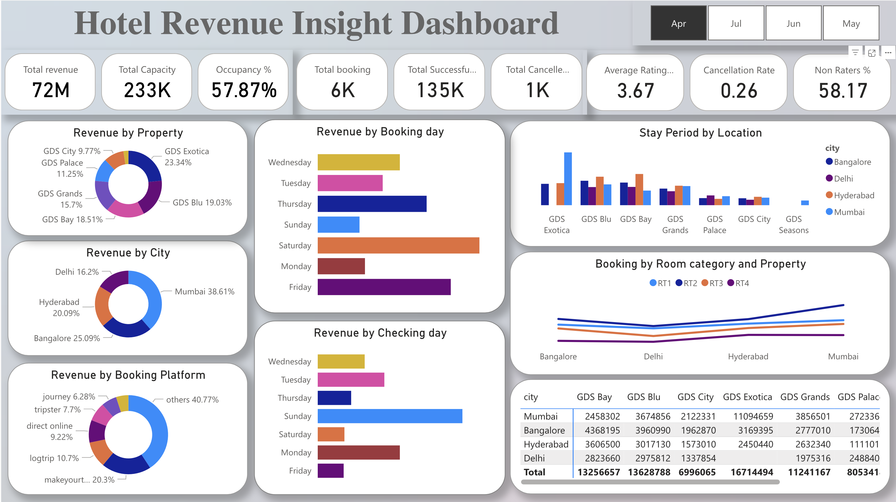
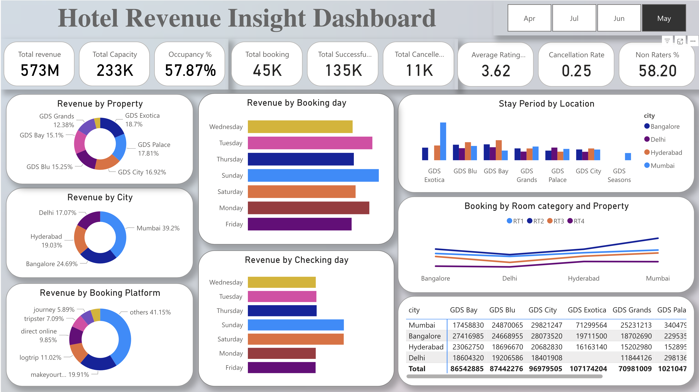
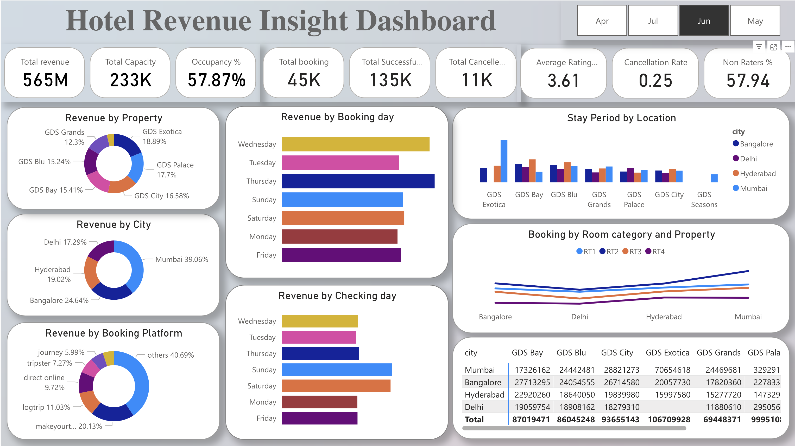
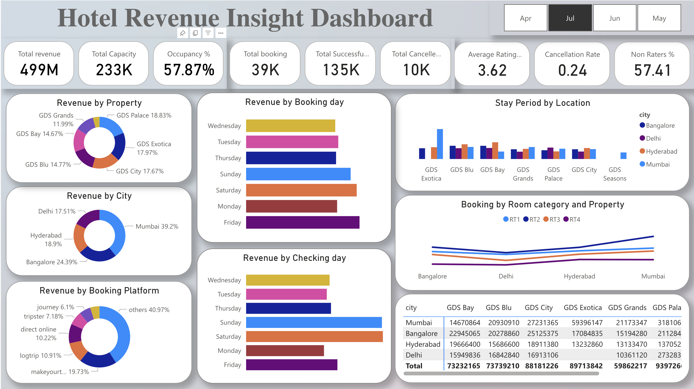

# hospitality-analytics-hackathon
This project is part of Data Analytics Bootcamp hackathon.
As the problem states to find out the total revenue.

The revenue_realised column represents the final amount of money that goes to the hotel based on booking status. If the booking status is cancelled, then 40% of the revenue generated is deducted and the remaining is refunded to the customer. If the booking status is Checked Out/No show, then full revenue generated will goes to hotels.

## =IF(D2="Cancelled", revenue_realized*0.6, revenue_realized)

If the booking status is "Cancelled" (as indicated by the value in column J), the formula multiplies the original revenue by 0.6 to deduct 40% of the revenue (as stated in the problem description).
If the booking status is anything other than "Cancelled," the original revenue is used unchanged.
Formula is applied to the cell, and then drag the fill handle (the small square at the bottom-right corner of the cell) down to fill the formula for all rows in the adjusted_revenue column.

But as there is too many rows , dragging might take some time so double click on the right corner of the cell after writing the formula.

load the excel file in power bi then 
check the rating_given is null in most of the rows. In that case replace the null values with 0 then 0 can be counted as rating_not_given. and go to add column - custom column - write the formula = if[rating_given] = 0 then "Non-Rater" else Text.

## From([ratings_given]) and can remove the original column

in dim_rooms make the rows as column.
to find a correlation between the non rater and raters with number of days stayed. in the fact_booking table
find out the difference between check in and check out date by adding new column. 
DAX query for this: Days_stayed = DATEDIFF ([check_in_date], [check_out_date], DAY)

then in same table make two column to find out the checkin_day and booking_day by creating new column and dax query for the two vcolumn :
Booking_day = FORMAT ( fact_bookings[booking_date], "dddd" )
checkin_day = FORMAT ( fact_bookings[check_in_date], "dddd" )
then after checking all the table close and apply.

in visualisation part:
## dd cards - add all calculation in merit list
change the font size of call out values to 25, change the card shapre with rounded rectangle.

1) total revenue by property name 
2) total revenue by city
3) total revenue by booking platform- donut chart
general - effects - visual border on - increase the rounded corners.
format - visual - in data label - category, data labels and turn off labels.

4) total stay period by diff hotel location - column chart
turn off the x axis title, y axis title and value, and from general switch off the title.

5) add the revenue_realised by checking day to understand the maximum checking on which day of the week through histogram.
do the customisation as needed.

6) add the revenue_realised by checking day to understand the maximum checking on which day of the week through histogram.
do the customisation as needed.

## Add text box and givwe the title increase and change the font size as you like font size - calibria math, and font size 36

Once the adjusted_revenue column is filled, we can calculate the total revenue by summing the values in this column. You can do this using the SUM function, like so:

1. Create a measure named Total Revenue using the following DAX formula:

Total Revenue = SUM(fact_bookings[revenue_realized])
This measure sums up the values in the revenue_realized column of the fact_bookings table.

2. Total Bookings:
Create a measure named Total Bookings using the following DAX formula:
Total Bookings = COUNTROWS(fact_bookings)
This measure counts the number of rows (bookings) in the fact_bookings table.

3. Average Rating:
Create a measure named Average Rating using the following DAX formula:

Average Rating = AVERAGE(fact_bookings[ratings_given])
This measure calculates the average of the ratings_given column in the fact_bookings table.

4. Total Capacity:
Create a measure named Total Capacity using the following DAX formula:

Total Capacity = SUM(fact_aggregated_bookings[capacity])
This measure sums up the values in the capacity column of the fact_aggregated_bookings table.
5. Total Successful Bookings:
Create a measure named Total Successful Bookings using the following DAX formula:

Total Successful Bookings = SUM(fact_aggregated_bookings[successful_bookings])
This measure sums up the values in the successful_bookings column of the fact_aggregated_bookings table.

6. Occupancy %:
Create a measure named Occupancy % using the following DAX formula:

Occupancy % = DIVIDE([Total Successful Bookings], [Total Capacity], 0)
This measure calculates the ratio of total successful bookings to total capacity, handling potential division by zero errors.

7. Total Cancelled Bookings:
Create a measure named Total Cancelled Bookings using the following DAX formula:

Total Cancelled Bookings = CALCULATE(COUNTROWS(fact_bookings), fact_bookings[booking_status] = "Cancelled")
This measure counts the number of rows (bookings) in the fact_bookings table where the booking_status is "Cancelled".

## Visulization Dashboard
### Apr

### May

### Jun 

### Jul

